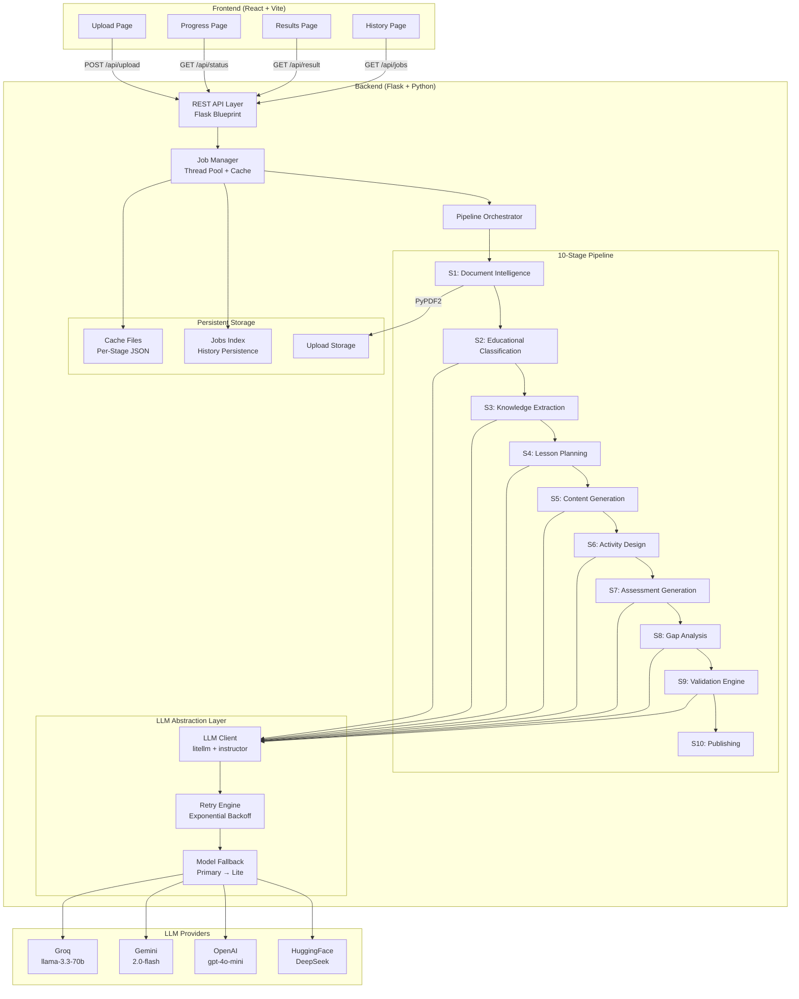
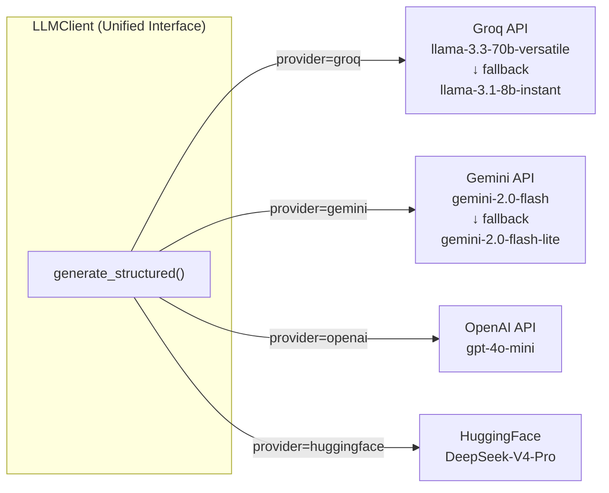
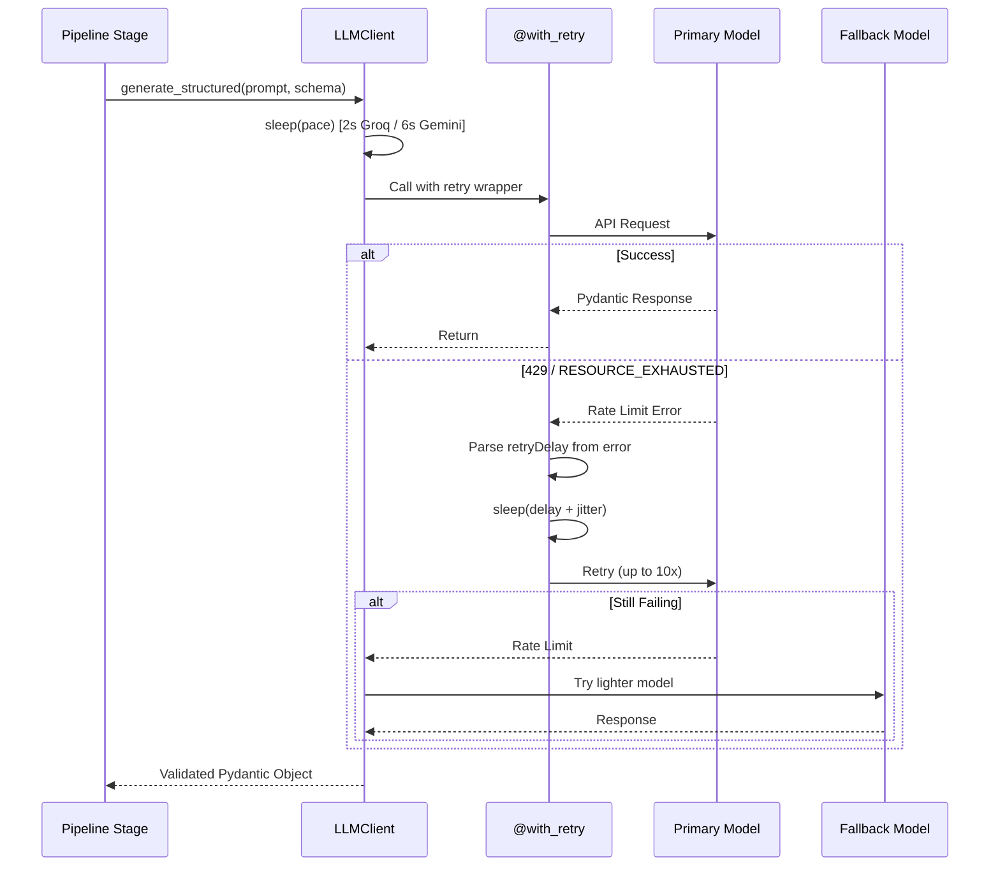
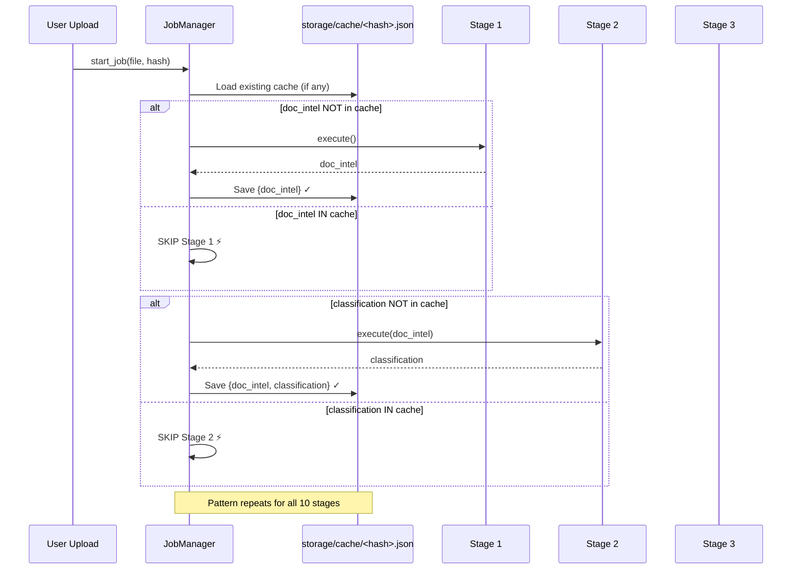
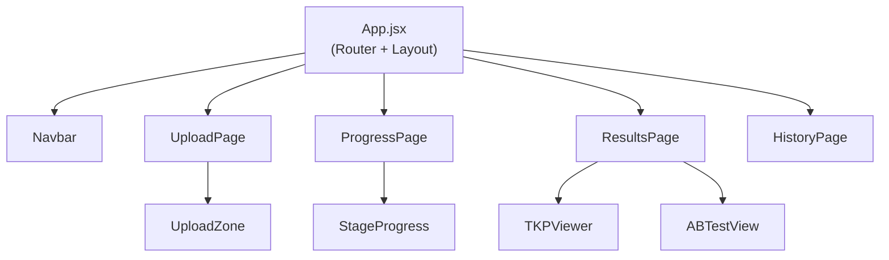

# Teacher Knowledge Package (TKP) Generator — Design Document

> **Project**: Multi-Agent AI-Powered Teacher Support Platform  
> **Institution**: Indian Institute of Technology Mandi  

---

## 1. Executive Summary

The TKP Generator is a production-grade, AI-powered platform that transforms raw educational documents (PDFs, text files) into comprehensive **Teacher Knowledge Packages** — structured, multi-period lesson plans enriched with activities, assessments, gap analysis, and quality validation.

The system implements a **10-stage sequential pipeline** where each stage produces a strictly-typed Pydantic schema output, enabling full traceability from source document to final deliverable. The architecture prioritizes **cost efficiency** (local-first parsing, per-stage caching, automatic model fallback), **resilience** (exponential backoff retries, stage-level resume), and **multi-provider LLM support** (Groq, Gemini, OpenAI, HuggingFace).

---

## 2. System Architecture

### 2.1 High-Level Architecture



### 2.2 Technology Stack

| Layer | Technology | Purpose |
|-------|-----------|---------|
| Frontend | React 18 + Vite | SPA with client-side routing |
| Styling | Vanilla CSS | Glassmorphism, dark mode, animations |
| Icons | Lucide React | Consistent iconography |
| Backend | Flask 3.x | REST API server |
| LLM Routing | LiteLLM + Instructor | Multi-provider structured output |
| Schema Validation | Pydantic v2 | Type-safe stage I/O contracts |
| PDF Parsing | PyPDF2 | Local text extraction (zero API cost) |
| Caching | File-based JSON | Per-stage persistence and resume |
| Concurrency | Python `threading` | Background pipeline execution |

---

## 3. Pipeline Architecture

### 3.1 Stage Flow Diagram

```mermaid
flowchart LR
    PDF[/"PDF Document"/] --> S1

    subgraph Phase1["Phase 1: Understanding"]
        S1["Stage 1<br/>Document Intelligence<br/><i>FREE - Local PyPDF2</i>"]
        S2["Stage 2<br/>Educational Classification<br/><i>1 API Call</i>"]
        S3["Stage 3<br/>Knowledge Extraction<br/><i>1 API Call</i>"]
    end

    subgraph Phase2["Phase 2: Planning"]
        S4["Stage 4<br/>Lesson Planning<br/><i>1 API Call</i>"]
        S5["Stage 5<br/>Content Generation<br/><i>N API Calls</i>"]
    end

    subgraph Phase3["Phase 3: Enrichment"]
        S6["Stage 6<br/>Activity Design<br/><i>N API Calls</i>"]
        S7["Stage 7<br/>Assessment Generation<br/><i>1 API Call</i>"]
        S8["Stage 8<br/>Gap Analysis<br/><i>1 API Call</i>"]
    end

    subgraph Phase4["Phase 4: Quality"]
        S9["Stage 9<br/>Validation Engine<br/><i>1 API Call</i>"]
        S10["Stage 10<br/>Publishing<br/><i>FREE - No API</i>"]
    end

    S1 --> S2 --> S3 --> S4 --> S5 --> S6 --> S7 --> S8 --> S9 --> S10

    S10 --> TKP[/"Teacher Knowledge<br/>Package (JSON)"/]

    style S1 fill:#2d6a4f,color:#fff
    style S10 fill:#2d6a4f,color:#fff
    style TKP fill:#e76f51,color:#fff
```




### 3.2 Stage Details

#### Stage 1 — Document Intelligence (Local, Free)

**Purpose**: Parses uploaded PDF/text files into structured semantic chunks using PyPDF2 locally. Zero API cost.

| Property | Value |
|----------|-------|
| Input | `file_path: str`, `ref_path: Optional[str]` |
| Output | `DocumentIntelResult` |
| API Calls | **0** (local PyPDF2) |
| Caching Key | `doc_intel` |

**Smart Chunking Algorithm**:
- Detects headings via `ALL_CAPS` patterns, chapter/section markers
- Detects math via Unicode math symbols (`∫∑√±`)
- Detects tables via `|` pipe delimiters
- Reference material is prefixed with `[REFERENCE MATERIAL]`

#### Stage 2 — Educational Classification

**Purpose**: Classifies the document by subject, grade level, difficulty, and estimates teaching hours.

| Property | Value |
|----------|-------|
| Input | `doc_intel: dict` |
| Output | `EducationalClassification` |
| API Calls | **1** |
| Caching Key | `classification` |

**Output Schema**:
```
subject, sub_subject, grade_level, difficulty (Beginner/Intermediate/Advanced),
topic, chapter, category (Textbook/Research Paper/Lecture Notes/Reference),
language, board_alignment[], estimated_teaching_hours
```

#### Stage 3 — Knowledge Extraction

**Purpose**: Extracts learning objectives, concepts, definitions, formulae, and common misconceptions from document text.

| Property | Value |
|----------|-------|
| Input | `doc_intel: dict`, `classification: dict` |
| Output | `KnowledgeExtraction` |
| API Calls | **1** |
| Caching Key | `knowledge` |

**Output Schema**:
```
learning_objectives[], prerequisites[], concepts[], definitions[],
formulae[], keywords[], examples[], applications[],
misconceptions[], concept_map: Dict[str, List[str]]
```

#### Stage 4 — Lesson Planning

**Purpose**: Creates a multi-period teaching sequence distributing concepts across 45-minute sessions.

| Property | Value |
|----------|-------|
| Input | `classification: dict`, `knowledge: dict` |
| Output | `TeachingPlan` |
| API Calls | **1** |
| Caching Key | `lesson_plan` |

**Period calculation**: `num_periods = max(1, int((estimated_hours × 60) / 45))`

**Output Schema**:
```
total_periods, period_duration_minutes,
periods[]: { period_number, title, learning_objectives[], concepts_covered[],
             time_allocation: Dict[str, int], teaching_methodology, resources_needed[] }
```

#### Stage 5 — Content Generation

**Purpose**: Generates detailed teaching content for each period including teacher scripts, entry/exit tickets, and homework.

| Property | Value |
|----------|-------|
| Input | `TeachingPlan` (Pydantic object) |
| Output | `List[PeriodContent]` |
| API Calls | **1 per period** |
| Caching Key | `period_contents` |

**Output Schema** (per period):
```
period_number, critic_reflection, entry_ticket, teacher_script,
blackboard_notes, activities[], checkpoint_questions[],
exit_ticket, homework[], mentor_moment, differentiation
```

#### Stage 6 — Activity Design

**Purpose**: Designs classroom activities with timing, materials, and success criteria for each period.

| Property | Value |
|----------|-------|
| Input | `TeachingPlan` (Pydantic object) |
| Output | `List[Activity]` |
| API Calls | **1 per period** |
| Caching Key | `activities` |

**Output Schema**:
```
title, type (ActivityType enum), duration_minutes, materials_needed[],
teacher_instructions[], student_instructions, success_criteria[],
learning_objectives_addressed[]
```

#### Stage 7 — Assessment Generation (A/B Testing)

**Purpose**: Generates a comprehensive assessment battery with MCQs, short/long answer, numerical problems, and case-based questions. Includes distractor analysis for MCQs.

| Property | Value |
|----------|-------|
| Input | `knowledge: dict` |
| Output | `Assessment` |
| API Calls | **1** |
| Caching Key | `ab_test_assessment` |

**Output Schema**:
```
mcqs[]: { question, options[], correct_answer, distractor_analysis, bloom_level }
short_answer[], long_answer[], numerical[], case_based[],
answer_key, rubrics[]
```

#### Stage 8 — Gap Analysis

**Purpose**: Identifies potential learning gaps, misconceptions, and generates diagnostic questions with remedial strategies.

| Property | Value |
|----------|-------|
| Input | `knowledge: dict` |
| Output | `LearningGap` |
| API Calls | **1** |
| Caching Key | `gap_analysis` |

**Output Schema**:
```
concept, misconception, why_students_think_this,
diagnostic_question, severity (Low/Medium/High),
remedial_action, prerequisite_gap
```

#### Stage 9 — Validation Engine

**Purpose**: Cross-validates generated content against source document. Flags hallucinations, checks completeness and consistency.

| Property | Value |
|----------|-------|
| Input | `doc_intel: dict`, `lesson_plan: str` |
| Output | `ValidationReport` |
| API Calls | **1** |
| Caching Key | `validation` |

**Output Schema**:
```
is_valid: bool, completeness_score: float, consistency_score: float,
hallucination_flags[], structural_flags[],
time_validation: Dict[str, bool]
```

#### Stage 10 — Publishing (Free)

**Purpose**: Packages the final TKP output for export. No API calls.

| Property | Value |
|----------|-------|
| Input | None |
| Output | `dict` (format, version, ready_for_export) |
| API Calls | **0** |
| Caching Key | `publishing` |

---

## 4. Multi-Agent LLM Architecture

### 4.1 Provider Abstraction



### 4.2 Retry & Fallback Strategy



**Key Parameters**:
| Parameter | Value |
|-----------|-------|
| Max Retries | 10 |
| Base Delay | 10 seconds |
| Max Delay | 120 seconds |
| Backoff | Exponential (delay × 2) |
| Jitter | Random 1–5 seconds |
| Rate Limit Detection | `429`, `RESOURCE_EXHAUSTED`, `RateLimitError` |

### 4.3 Structured Output Generation

All LLM calls use the **Instructor** library with **LiteLLM** to enforce Pydantic schema compliance:

```python
# Every stage call follows this pattern:
client = LLMClient()  # Auto-selects provider from config
result = client.generate_structured(
    prompt="...",                          # Stage-specific prompt
    response_model=PydanticModel,          # Enforced output schema
    system_prompt="You are an expert...",  # Role definition
    language="English",                    # Multilingual injection
    temperature=0.2                        # Low temp for consistency
)
# result is a fully validated Pydantic object, never raw JSON
```

---

## 5. Caching & Resume Architecture

### 5.1 Per-Stage Incremental Caching



### 5.2 Resume-on-Failure Example

```
SCENARIO: Pipeline crashes at Stage 5 due to rate limit

1st run:  S1 ✅ → S2 ✅ → S3 ✅ → S4 ✅ → S5 💥 CRASH
          Cache: {doc_intel, classification, knowledge, lesson_plan}

2nd run:  S1 SKIP → S2 SKIP → S3 SKIP → S4 SKIP → S5 ✅ RESUMES → S6...
          Saved: 4 API calls, ~30 seconds
```

### 5.3 History Persistence

Job metadata is saved to `storage/cache/_jobs_index.json` and survives server restarts. On startup, `JobManager._load_history()` restores all previous jobs. Interrupted jobs are marked with status `"interrupted"`.

---

## 6. Cost Optimization Strategy

### 6.1 API Call Budget (Per Document)

| Stage | API Calls | Cost Strategy |
|-------|-----------|---------------|
| S1: Document Intelligence | **0** | Local PyPDF2 extraction |
| S2: Classification | 1 | Single structured call |
| S3: Knowledge Extraction | 1 | Chunked text (max 8000 chars) |
| S4: Lesson Planning | 1 | Single structured call |
| S5: Content Generation | N (≈2-3) | 1 per period |
| S6: Activity Design | N (≈2-3) | 1 per period |
| S7: Assessment | 1 | Single structured call |
| S8: Gap Analysis | 1 | Single structured call |
| S9: Validation | 1 | Single structured call |
| S10: Publishing | **0** | Local packaging |
| **Total** | **~8-12 calls** | |

### 6.2 Token Optimization

- **Prompt truncation**: Document text capped at 8000 characters per API call
- **Incremental caching**: Never re-processes completed stages
- **Dynamic pacing**: Provider-aware sleep (2s Groq vs 6s Gemini)
- **Automatic fallback**: Switches to lighter model on rate limits
- **Local-first parsing**: PyPDF2 handles all PDF extraction without API

---

## 7. Multilingual Support

When the user selects a target language other than English, the `LLMClient` injects a directive into every system prompt:

```
CRITICAL INSTRUCTION: You MUST generate all output exclusively in {language}.
Ensure educational terminology is accurately localized.
```

This is injected at the `LLMClient.generate_structured()` level, meaning **all 10 stages** automatically inherit multilingual capability without any stage-level code changes.

**Supported flow**:
```
Frontend (language dropdown) → API (form field) → JobManager (config) → 
BaseStage (self.config["language"]) → LLMClient (system prompt injection)
```

---

## 8. API Specification

### 8.1 Endpoints

| Method | Endpoint | Description | Auth |
|--------|----------|-------------|------|
| `POST` | `/api/upload` | Upload document & start pipeline | None |
| `GET` | `/api/jobs` | List all jobs (history) | None |
| `GET` | `/api/status/<job_id>` | Poll job progress | None |
| `GET` | `/api/result/<job_id>` | Get completed TKP result | None |
| `GET` | `/health` | Health check | None |

### 8.2 Upload Request

```http
POST /api/upload
Content-Type: multipart/form-data

file: <binary>              # Required. PDF or text file
reference_file: <binary>    # Optional. Supporting material
language: "English"         # Optional. Target output language
doc_type: "standard"        # Optional. Document complexity profile
```

### 8.3 Status Response

```json
{
    "id": "uuid",
    "status": "processing",
    "progress": 55,
    "stage": "Stage 5: Generating Content",
    "language": "English",
    "created_at": 1722800000.0
}
```

### 8.4 Result Response

```json
{
    "result": {
        "doc_intel": { "document_id": "...", "chunks": [...], "table_of_contents": [...] },
        "classification": { "subject": "Physics", "grade_level": "Grade 10", ... },
        "knowledge": { "learning_objectives": [...], "concepts": [...], ... },
        "lesson_plan": { "total_periods": 3, "periods": [...] },
        "period_contents": [ { "teacher_script": "...", ... } ],
        "activities": [ { "title": "...", "duration_minutes": 15, ... } ],
        "ab_test_assessment": { "mcqs": [...], "answer_key": {...} },
        "gap_analysis": { "concept": "...", "misconception": "...", ... },
        "validation": { "is_valid": true, "completeness_score": 0.92, ... },
        "publishing": { "format": "JSON", "version": "1.0.0" }
    }
}
```

---

## 9. Frontend Architecture

### 9.1 Component Hierarchy



### 9.2 Page Routing

| Route | Component | Description |
|-------|-----------|-------------|
| `/` | UploadPage | File upload + configuration |
| `/progress/:jobId` | ProgressPage | Real-time pipeline progress |
| `/results/:jobId` | ResultsPage | TKP viewer + A/B test view |
| `/history` | HistoryPage | All past jobs |

### 9.3 Design System

- **Theme**: Dark mode with glassmorphism effects
- **Typography**: Modern sans-serif (system fonts)
- **Animations**: CSS transitions on hover, progress bars, page transitions
- **Responsiveness**: Fluid layout with CSS variables

---

## 10. Project Structure

```
Application/
├── backend/
│   ├── run.py                          # Entry point
│   ├── .env                            # API keys & provider config
│   ├── app/
│   │   ├── __init__.py
│   │   ├── main.py                     # Flask app factory
│   │   ├── config.py                   # Environment configuration
│   │   ├── api/
│   │   │   ├── __init__.py
│   │   │   └── routes.py              # REST API endpoints
│   │   ├── llm/
│   │   │   ├── __init__.py
│   │   │   ├── client.py              # Multi-provider LLM client
│   │   │   └── retry.py              # Exponential backoff decorator
│   │   ├── models/                    # Pydantic schemas (10 stages + TKP)
│   │   │   ├── stage1_doc_intel.py
│   │   │   ├── stage2_classification.py
│   │   │   ├── stage3_knowledge.py
│   │   │   ├── stage4_planner.py
│   │   │   ├── stage5_content.py
│   │   │   ├── stage6_activities.py
│   │   │   ├── stage7_assessment.py
│   │   │   ├── stage8_gap_analysis.py
│   │   │   ├── stage9_validation.py
│   │   │   ├── stage10_publishing.py
│   │   │   └── tkp.py               # Master TKP aggregator
│   │   ├── orchestrator/
│   │   │   ├── __init__.py
│   │   │   ├── pipeline.py           # Phase-level orchestration
│   │   │   └── job_manager.py        # Job lifecycle + caching + history
│   │   ├── parsers/
│   │   │   ├── __init__.py
│   │   │   └── pdf_parser.py         # Local PyPDF2 parser
│   │   └── stages/                   # Pipeline stage implementations
│   │       ├── base.py               # Abstract BaseStage
│   │       ├── s1_document_intelligence.py
│   │       ├── s2_educational_classification.py
│   │       ├── s3_knowledge_extraction.py
│   │       ├── s4_lesson_planner.py
│   │       ├── s5_content_generation.py
│   │       ├── s6_activities.py
│   │       ├── s7_assessment.py
│   │       ├── s8_gap_analysis.py
│   │       ├── s9_validation.py
│   │       └── s10_publishing.py
│   └── storage/
│       ├── uploads/                   # Uploaded documents
│       ├── cache/                     # Per-stage JSON cache + jobs index
│       └── outputs/                   # Generated outputs
│
└── frontend/
    ├── index.html
    ├── vite.config.js
    └── src/
        ├── App.jsx
        ├── index.css                  # Design system
        ├── pages/
        │   ├── UploadPage/
        │   ├── ProgressPage/
        │   ├── ResultsPage/
        │   └── HistoryPage/
        └── components/
            ├── Navbar/
            ├── UploadZone/
            ├── StageProgress/
            ├── TKPViewer/
            └── ABTestView/
```

---

## 11. Observability & Logging

The platform uses Python's `logging` module throughout:

- **Stage-level logging**: Each stage logs start, completion, and skip (cached) events
- **LLM client logging**: Logs rate limit warnings, fallback activations, retry delays
- **Job manager logging**: Logs cache loads, state saves, pipeline errors with stage context
- **Error context**: Pipeline errors include the failing stage name in the error message

```python
# Example log output during a cached resume:
INFO  - Loaded cached state with keys: ['doc_intel', 'classification', 'knowledge']
INFO  - Stage 1 skipped (cached)
INFO  - Stage 2 skipped (cached)
INFO  - Stage 3 skipped (cached)
INFO  - Stage 4 complete: Lesson plan created
WARN  - API rate limit hit (attempt 1/10). Waiting 15s...
INFO  - Stage 5 complete: Content generated
```

---

## 12. Security Considerations

- **File validation**: Uploads capped at 16MB via `MAX_CONTENT_LENGTH`
- **Filename sanitization**: `werkzeug.utils.secure_filename()` prevents path traversal
- **API keys**: Stored in `.env`, never hardcoded or exposed to frontend
- **CORS**: Enabled via `flask-cors` for frontend-backend communication
- **No authentication** in current prototype (noted as future work)

---

## 13. Future Enhancements

> [!NOTE]
> These are documented as potential extensions beyond the current implementation scope.

- [ ] **Board-wise curriculum alignment** (CBSE, ICSE, Common Core mapping)
- [ ] **User authentication** (JWT-based login for teachers)
- [ ] **PDF export** (generate downloadable lesson plan PDFs)
- [ ] **Real-time WebSocket** progress (replace polling)
- [ ] **A/B test comparison UI** (side-by-side assessment variants)
- [ ] **Batch processing** (multiple documents in parallel)
- [ ] **RAG pipeline** (retrieval-augmented generation over uploaded docs)

---

## 14. References

- [PLACEHOLDER: Add academic references]
- [PLACEHOLDER: Add NCERT curriculum framework references]
- [PLACEHOLDER: Add LiteLLM documentation link]
- [PLACEHOLDER: Add Instructor library documentation link]
- [PLACEHOLDER: Add Pydantic v2 documentation link]

---

*Document generated from codebase analysis — all architecture diagrams and schemas are strictly derived from the actual implementation.*
